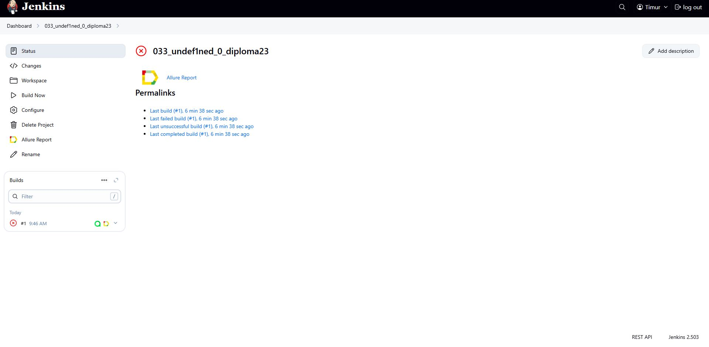
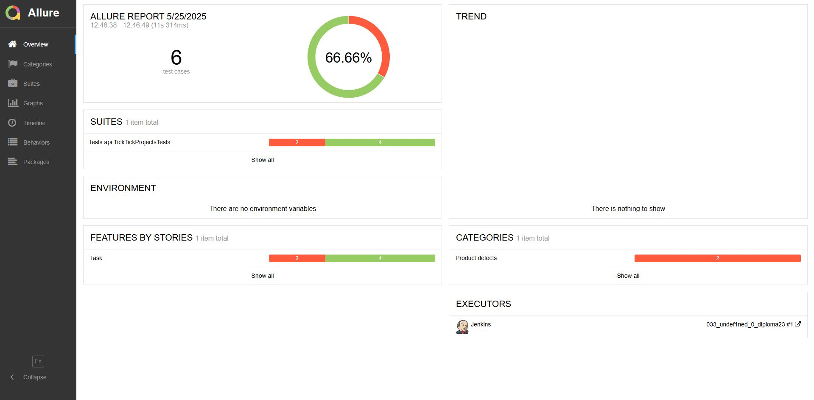
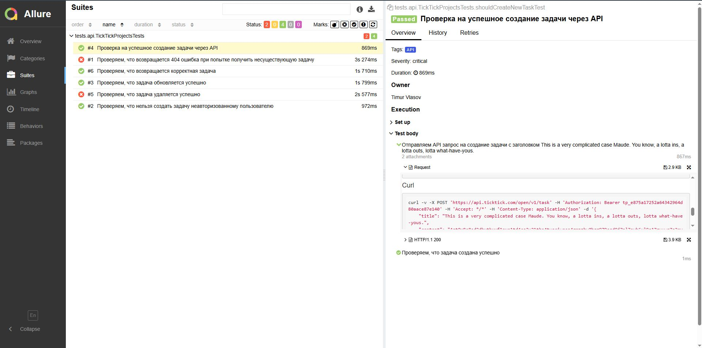
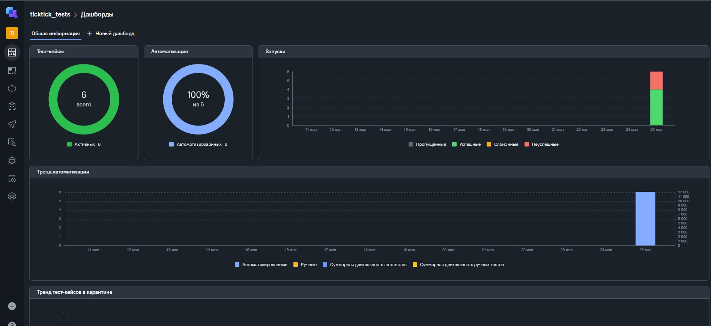
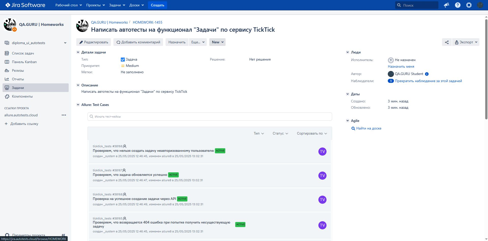
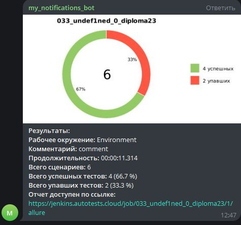

# Проект по автоматизации API для компании [TickTick](https://ticktick.com/)
____

> TickTick — это многофункциональное приложение для управления задачами и повышения личной продуктивности. Оно сочетает в себе планировщик задач, календарь, трекер привычек и инструменты для концентрации, такие как таймер «Помодоро». Доступно на различных платформах: Android, iOS, Windows, macOS и через веб-интерфейс, с полной синхронизацией между устройствами

## Содержание:
___

- <a href="#tools">Технологии и инструменты</a>
- <a href="#cases">Примеры автоматизированных тест-кейсов</a>
- <a href="#jenkins">Сборка в Jenkins</a>
- - <a href="#jenkins-params">Параметры сборки в Jenkins</a>
- - <a href="#commands">Команды для запуска из терминала</a>
- <a href="#allure">Allure Report</a>
- - <a href="#allure-report">Основная страница отчета</a>
- - <a href="#allure-cases">Тест-кейсы</a>
- <a href="#testops">Интеграция с Allure TestOps</a>
- <a href="#jira">Интеграция с JIRA</a>
- <a href="#telegram">Уведомления в телеграм при помощи бота</a>
___

<a id="tools"></a>
## Технологии и инструменты:
<p align="center">
<a href="https://www.jetbrains.com/idea/"></a>
<a href="https://www.java.com/"></a>
<a href="https://junit.org/junit5/"></a>
<a href="https://github.com/"></a>
<a href="https://gradle.org/"></a>
<a href="https://www.jenkins.io/"></a>
<a href="https://allurereport.org/"></a>
<a href="https://qameta.io/"></a>
<a href="https://www.atlassian.com/software/jira"></a>
</p>

<a id="cases"></a>
## Примеры автоматизированных тест-кейсов:
- Проверка создания задачи
- Проверка корректного обновления задачи
- Проверка корректного удаления задачи
- Проверка получения задачи по ID
- Попытка создать задачу под неавторизованным пользователем
- Попытка получить задачу по несуществующему ID

<a id="jenkins"></a>
##  Сборка в [Jenkinks](https://jenkins.autotests.cloud/job/033_undef1ned_0_hw14/)


<a id="jenkins-params"></a>
### Параметры сборки в Jenkins
- *URL* (Ссылка на API)
- *API_KEY* (Ключ доступа к API)

<a id="commands"></a>
### Команды для запуска из терминала

Локальный запуск:
```bash
gradle clean -Denv=local test
```

Удалённый запуск через Jenkins:
```bash
gradle clean test
"-Denv=remote"
"-Durl=${URL}"
"-Dapi_key=${API_KEY}"
```

<a id="allure"></a>
##  Allure Report
___

<a id="allure-report"></a>
### Основная страница отчета


<a id="allure-cases"></a>
### Тест-кейсы


<a id="testops"></a>
##  Интеграция с Allure TestOps


<a id="jira"></a>
##  Интеграция с JIRA


<a id="telegram"></a>
##  Уведомления в телеграм при помощи бота:
___
